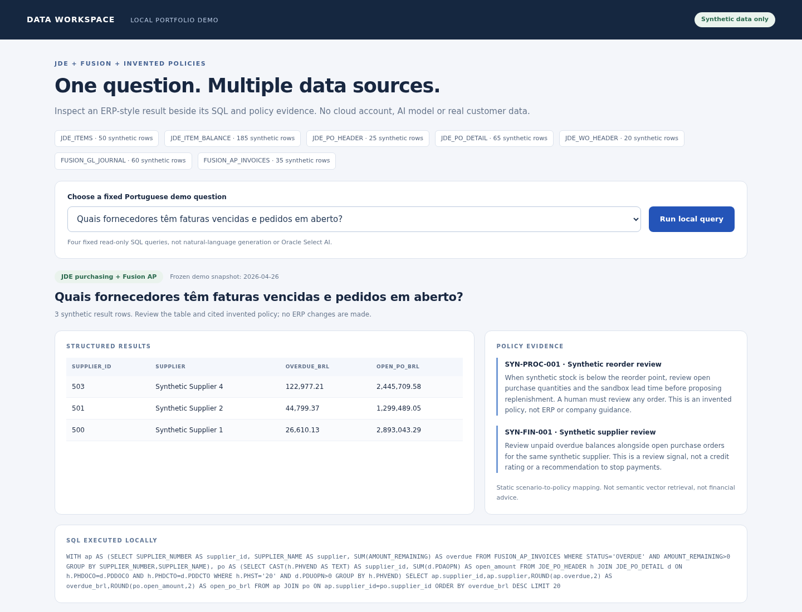

# Oracle AIDP-inspired enterprise data workspace

A local, read-only portfolio demo that combines synthetic JDE-style operational data, Fusion-style finance data and invented policy evidence. Adapted from the `Oracle_AIDP_SaaS` project.

**This is not an Oracle AIDP deployment.** It uses SQLite, FastAPI and pandas. It has no live Oracle connection, LLM, Select AI, embeddings or vector search. The four questions are mapped to fixed SQL; policies are mapped to scenarios. No model generates the answer.



## Run locally

Tested with Python 3.10 on Linux. Python 3.10+ is required; other versions are not yet validated.

```bash
python -m venv .venv
source .venv/bin/activate
python -m pip install -r requirements.txt
python -m uvicorn app.main:app --host 127.0.0.1 --port 8000
```

Open http://127.0.0.1:8000. Windows users can activate with `.venv\Scripts\activate`. No `.env`, API key or cloud account is needed. Keep it bound to localhost: there is no authentication or production hardening.

## What works

- Seven in-memory synthetic tables: items, branch balances, purchase headers/details, manufacturing work orders, GL journals and AP invoices.
- Four fixed questions: below-reorder stock, overdue supplier balances, suppliers with both overdue invoices and open purchase orders, and in-process work orders.
- The integrated query aggregates AP and purchasing independently before joining. This avoids inflating balances through a many-to-many detail join.
- Visible SQL and invented policy IDs beside the results. At most 20 rows per query.
- A clean local worksheet in `notebooks/01_local_workspace.ipynb`, with no stored outputs. Its code cells are executed in the test suite.

GL journals are loaded for architecture context, but the four UI queries do not use them. Document evidence consists of two invented text policies, not PDF ingestion.

## Data and semantics

All suppliers, user labels, IDs, dates, balances and operational quantities are synthetic. The default seed is 42; rebuilding the workspace in the same runtime produces the same fixtures. AP status is frozen as of **2026-04-26**, not the current date. Monetary values use synthetic BRL amounts. Floating-point storage is acceptable for a demo, not accounting.

JDE-style names and status codes are illustrative analytical conventions, not certified ERP mappings. Company/branch IDs are fictional. The purchase query defines open as header status `20` with positive open line quantity. Work orders use toy `30`/`40` in-process statuses. The fixture CYYDDD helper is intended for 1900-2099 dates. This does not validate real ERP business rules.

## Architecture

```text
Adapted seeded fixture generators
    -> pandas DataFrames
    -> read-only in-memory SQLite
    -> allowlisted fixed SQL queries
    -> local FastAPI + static UI
    -> results + SQL + scenario-linked invented policy citations
```

The API accepts a question ID, never arbitrary SQL. It makes no runtime requests to Oracle or any external service. Installing dependencies and the optional browser test do require internet access.

`reference/oracle/analytical_tables.sql` preserves a trimmed analytical schema reference from the source project. It is **not executed, deployment-ready or tested against Oracle**. No user creation, passwords, grants, cloud provisioning or vector index is shipped. It is optional reading only.

## Test

```bash
python -m pip install -r requirements-dev.txt
python -m pytest -q
python scripts/scan_release.py
python -m playwright install chromium
python scripts/browser_smoke.py
```

The browser smoke starts its own localhost server on port 8003, runs all four UI scenarios and refreshes `docs/demo-running.png`. The release check is a limited heuristic for likely secrets, addresses, unsafe TLS configuration and forbidden artifacts, not proof of absence or a security audit. The included CI workflow is staged but has not run remotely.

## Limits

No SaaS integration, autonomous actions, general question answering, production data, OAuth, OCI provisioning, cloud storage, PDF ingestion, semantic retrieval or RAG. Policies are invented and not financial advice. Fixtures do not satisfy every real ERP constraint, and GL data is not a balanced accounting ledger. Do not expose the server publicly or use the outputs for real decisions.

## Provenance and license

Generators and the trimmed Oracle schema are adapted from the owner's `Oracle_AIDP_SaaS` portfolio source. The local workspace, tests, UI and worksheet were added for a runnable public-demo candidate. No original Git history, secrets, private URLs or notebook outputs are included. See [scope changes](docs/scope-changes.md).

MIT. Oracle, JD Edwards and Fusion names identify the architecture inspiration; this project is not an official Oracle product or endorsed integration.
